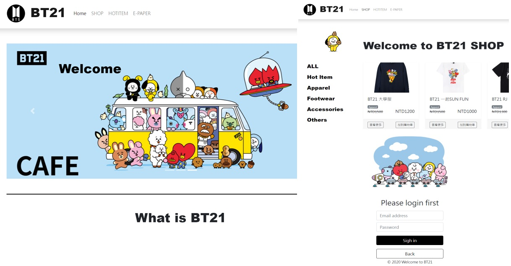

  

[網站Demo](https://willta98.github.io/BT21-Demo/dist/#/)  
[Git](https://github.com/Willta98/BT21-Demo)

描述:  
此專案是使用HTML5、CSS和JavaScript搭配Vue.js框架製作的。為了提升網站的外觀和使用者體驗，採用了Bootstrap來設計網站的屬性和版面配置。同時，為了確保在不同裝置上的流暢瀏覽，採用了RWD（響應式設計），使網頁內容能夠根據訪問者的裝置大小自動調整排列和顯示方式。  

這個電商網站還整合了後台管理系統，使用者可以透過後台管理界面來進行單品和優惠券等內容的調整並與API進行串接，確保了數據的及時同步和準確性。

網站還包含以下功能：  
購物車功能：可以將商品加入購物車，方便結算和購買。  
商品搜索和篩選：使用者可以根據不同的條件來搜索和篩選商品。   
我的最愛：使用者可以將他們喜歡的商品收藏起來，方便日後查看和購買。  
