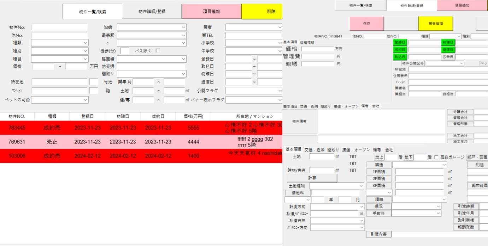

  

[home-management](https://github.com/willta981165/home-management)  

描述:  
此專案是使用Python的Tkinter製作的GUI程式，目的是將目前所有的紙本資料進行數據化，透過前後端的呼應將資料儲存至資料庫中。  
後端使用了Django搭配MySQL進行進行資料處理與回傳，進行數據的存儲、處理和管理，最終實現資料的數據化和管理。  

後期預計將後端設置在雲端Server上，這樣可以實現更好的穩定性、可擴展性和可靠性。  
通過將後端部署在雲端Server上，可以實現遠程訪問、即時更新等功能，從而更好地支持使用者的需求。

此GUI程式包含以下功能：  
GUI介面：使用Python的Tkinter製作的GUI程式，提供使用者友好的操作界面，使其能夠輕鬆地進行數據化工作。  
資料數據化：用戶可以通過GUI介面將目前所有的紙本資料進行 數據化，這包括將紙本資料中的文字、數字等信息輸入到系統中。  
資料庫儲存：在這個專案中，使用MySQL作為資料庫管理系統，將資料存入相應的數據表中。  
Django後端：包括路由設置、資料庫操作、API開發等，接收前端GUI介面提交的數據，進行相應的處理，並將處理後的數據存入MySQL資料庫中。  